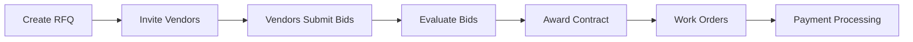

# RFQ Workflow Guide - Monarch Property Management

**Version:** 1.0  
**Last Updated:** 2025-10-27  
**Phase:** 9 - Multi-Tenant RFQ/Procurement

---

## Overview

This guide documents the complete Request for Quotation (RFQ) workflow in Monarch Property Management, from creation to contract award and payment processing.

---

## Workflow Stages



---

## Stage 1: Create RFQ

**Role Required:** Admin or Property Manager  
**RPC Function:** `app.create_rfq()`

### Steps

1. Navigate to RFQ Management Dashboard
2. Click "Create RFQ Project"
3. Fill in required fields:
   - Property ID (select from dropdown)
   - Title (e.g., "HVAC Maintenance Q1 2025")
   - Description (detailed scope of work)
   - Deadline (bid submission deadline)
   - Lot items (line items for bidding)

### Lot Structure

Each RFQ can have multiple "lots" (line items):

```json
{
  "name": "HVAC Filter Replacement",
  "uom": "unit",
  "qty": 24
}
```

**UOM Options:** unit, hour, sqft, lump sum

### Database Actions

```sql
-- Creates record in rfqs table
INSERT INTO rfqs (property_id, title, description, deadline, tenant_id, status)
VALUES (...);

-- Creates lot items in rfq_lots table
INSERT INTO rfq_lots (rfq_id, name, uom, qty, tenant_id)
VALUES (...);
```

### Audit Log

```json
{
  "action": "RFQ_CREATED",
  "table_name": "rfqs",
  "new_values": {
    "title": "HVAC Maintenance Q1 2025",
    "status": "draft",
    "tenant_id": "...",
    "deadline": "2025-12-31"
  }
}
```

---

## Stage 2: Invite Vendors

**Role Required:** Admin or Property Manager  
**RPC Function:** `app.invite_vendors_to_rfq()`

### Steps

1. Select created RFQ
2. Click "Invite Vendors"
3. Choose vendors from verified vendor list
4. Click "Send Invitations"

### Selection Criteria

- Verified vendors only
- Match by specialty (HVAC, Plumbing, etc.)
- Active subscription status
- Good rating history

### Database Actions

```sql
-- Creates invitation records
INSERT INTO rfq_invites (rfq_id, vendor_id, tenant_id, status)
VALUES (...);

-- Updates RFQ status to 'open'
UPDATE rfqs SET status = 'open' WHERE id = ...;
```

### Vendor Notification

Vendors receive:
- Email notification
- In-app notification
- Dashboard alert

---

## Stage 3: Vendors Submit Bids

**Role Required:** Vendor  
**RPC Function:** `app.submit_bid()`

### Vendor View

1. Navigate to "My Invitations"
2. View RFQ details
3. Download RFQ documents (if any)
4. Click "Submit Bid"
5. Fill in bid form:
   - Total bid amount
   - Unit prices per lot
   - Proposal details
   - Estimated duration

### Bid Structure

```json
{
  "rfq_id": "uuid",
  "bid_amount": 15000.00,
  "bid_lines": [
    {
      "rfq_lot_id": "uuid",
      "unit_price": 625.00
    }
  ]
}
```

### Authorization Check

```sql
-- Function verifies vendor is invited
IF NOT EXISTS (
  SELECT 1 FROM rfq_invites 
  WHERE rfq_id = p_rfq_id 
    AND vendor_id = app.user_id() 
    AND status = 'invited'
) THEN
  RAISE EXCEPTION 'Not invited to this RFQ';
END IF;
```

### Database Actions

```sql
-- Creates bid record
INSERT INTO bids (rfq_id, vendor_id, tenant_id, bid_amount, status)
VALUES (...);

-- Creates bid line items
INSERT INTO bid_lines (bid_id, rfq_lot_id, unit_price, tenant_id)
VALUES (...);

-- Updates invitation status
UPDATE rfq_invites 
SET status = 'bid_submitted', responded_at = now()
WHERE rfq_id = ... AND vendor_id = ...;
```

---

## Stage 4: Evaluate Bids

**Role Required:** Admin or Property Manager  
**UI Component:** Bid Comparison Table

### Evaluation Criteria

1. **Price Competitiveness**
   - Total bid amount
   - Unit pricing
   - Value for money

2. **Vendor Qualifications**
   - Rating history
   - Completed jobs
   - Specialty match
   - Verification status

3. **Proposal Quality**
   - Detailed scope
   - Timeline feasibility
   - Resource allocation

### Comparison View

| Vendor | Total Bid | Rating | Jobs | Timeline |
|--------|-----------|--------|------|----------|
| Vendor A | $15,000 | 4.8/5 | 127 | 2 weeks |
| Vendor B | $12,500 | 4.5/5 | 89 | 3 weeks |
| Vendor C | $18,000 | 4.9/5 | 203 | 1 week |

---

## Stage 5: Award Contract

**Role Required:** Admin or Property Manager  
**RPC Function:** `app.award_contract()`

### Steps

1. Select winning bid
2. Click "Award Contract"
3. Specify contract details:
   - Contract amount (can adjust from bid)
   - Start date
   - End date
   - Terms & conditions

### Database Actions

```sql
-- Creates contract
INSERT INTO contracts (
  rfq_id, vendor_id, tenant_id, contract_number,
  total_amount, start_date, end_date, status
) VALUES (...);

-- Updates RFQ status
UPDATE rfqs SET status = 'awarded' WHERE id = ...;

-- Updates winning bid
UPDATE bids SET status = 'accepted' 
WHERE rfq_id = ... AND vendor_id = ...;

-- Rejects other bids
UPDATE bids SET status = 'rejected'
WHERE rfq_id = ... AND vendor_id != ...;
```

### Contract Number Format

```
CNT-YYYYMMDD-XXXXXX
Example: CNT-20251027-a3f9c2
```

### Vendor Notification

Winning vendor receives:
- Contract award notification
- Contract document (PDF)
- Next steps instructions

Losing vendors receive:
- Bid rejection notification
- Thank you message
- Invitation to future RFQs

---

## Stage 6: Work Orders

**Role Required:** Admin, Property Manager, Vendor  
**Table:** `work_orders`

### Creating Work Orders

Once contract is awarded:

1. Create work orders for specific tasks
2. Assign to vendor
3. Set milestones and deadlines
4. Track progress

### Work Order Statuses

- **Scheduled** - Work planned
- **In Progress** - Work started
- **On Hold** - Temporarily paused
- **Completed** - Work finished
- **Verified** - Quality check passed

---

## Stage 7: Payment Processing

**Role Required:** Admin or Property Manager  
**RPC Function:** `app.approve_invoice()`

### Payment Workflow

1. Vendor submits invoice
2. Admin/PM reviews invoice
3. Verify work completion
4. Approve payment
5. Process through accounting
6. Mark as paid

### Payment Table Structure

```sql
CREATE TABLE payments (
  id uuid PRIMARY KEY,
  contract_id uuid REFERENCES contracts,
  vendor_id uuid,
  invoice_number text,
  amount numeric,
  due_date date,
  paid_date date,
  status text,  -- pending, approved, paid, rejected
  tenant_id uuid
);
```

### Invoice Approval

```sql
-- Approve invoice
UPDATE payments 
SET status = 'approved', approved_by = app.user_id(), approved_at = now()
WHERE id = ... AND tenant_id = app.current_tenant();
```

---

## Security & Authorization

### Role-Based Access

| Action | Admin | Property Manager | Vendor | Tenant |
|--------|-------|------------------|--------|--------|
| Create RFQ | ✅ | ✅ | ❌ | ❌ |
| Invite Vendors | ✅ | ✅ | ❌ | ❌ |
| View RFQs | ✅ | ✅ | ✅ (invited only) | ❌ |
| Submit Bid | ❌ | ❌ | ✅ | ❌ |
| Award Contract | ✅ | ✅ | ❌ | ❌ |
| Approve Invoice | ✅ | ✅ | ❌ | ❌ |

### Tenant Isolation

All queries automatically filtered by `tenant_id`:

```sql
-- User can only see their tenant's data
SELECT * FROM rfqs WHERE tenant_id = app.current_tenant();
```

**Cross-tenant access:** ❌ BLOCKED by RLS

---

## Best Practices

### For Admins/Property Managers

1. **Create Detailed RFQs**
   - Clear scope of work
   - Specific requirements
   - Realistic deadlines

2. **Invite Multiple Vendors**
   - Minimum 3 vendors per RFQ
   - Match by specialty
   - Include verified vendors

3. **Fair Evaluation**
   - Consider price AND quality
   - Check vendor history
   - Document selection rationale

4. **Timely Communication**
   - Respond to vendor questions
   - Notify on status changes
   - Provide feedback on rejected bids

### For Vendors

1. **Respond Promptly**
   - Review RFQ within 24 hours
   - Ask clarifying questions early
   - Submit bids before deadline

2. **Competitive Pricing**
   - Research market rates
   - Include all costs
   - Justify premium pricing

3. **Professional Proposals**
   - Detailed scope breakdown
   - Clear timeline
   - Highlight qualifications

4. **Quality Delivery**
   - Meet deadlines
   - Maintain quality standards
   - Document work completed

---

## Troubleshooting

### Common Issues

**Issue:** Vendor not seeing RFQ invitation  
**Solution:** Check vendor's subscription status and email settings

**Issue:** Cannot submit bid  
**Solution:** Verify vendor is invited and RFQ is still open

**Issue:** Contract not created after award  
**Solution:** Check RPC function logs and authorization

**Issue:** Payment not processing  
**Solution:** Verify invoice details and approval workflow

---

## API Reference

### Create RFQ

```typescript
const { data, error } = await supabase.rpc('create_rfq', {
  p_property_id: 1,
  p_title: 'HVAC Maintenance',
  p_description: 'Quarterly service',
  p_deadline: '2025-12-31',
  p_lots: [
    { name: 'Filter Replacement', uom: 'unit', qty: 24 }
  ]
});
```

### Invite Vendors

```typescript
const { data, error } = await supabase.rpc('invite_vendors_to_rfq', {
  p_rfq_id: 'uuid',
  p_vendor_ids: ['uuid1', 'uuid2', 'uuid3']
});
```

### Submit Bid

```typescript
const { data, error } = await supabase.rpc('submit_bid', {
  p_rfq_id: 'uuid',
  p_bid_amount: 15000.00,
  p_bid_lines: [
    { rfq_lot_id: 'uuid', unit_price: 625.00 }
  ]
});
```

### Award Contract

```typescript
const { data, error } = await supabase.rpc('award_contract', {
  p_rfq_id: 'uuid',
  p_vendor_id: 'uuid',
  p_contract_amount: 15000.00,
  p_start_date: '2025-01-01',
  p_end_date: '2025-12-31'
});
```

---

## Support

For technical issues or questions:
- Email: support@monarchpropertymmgt.com
- Documentation: https://docs.monarchpropertymmgt.com
- Issue Tracker: GitHub Issues

---

**Document Version:** 1.0  
**Last Updated:** 2025-10-27  
**Maintained By:** Monarch Development Team
