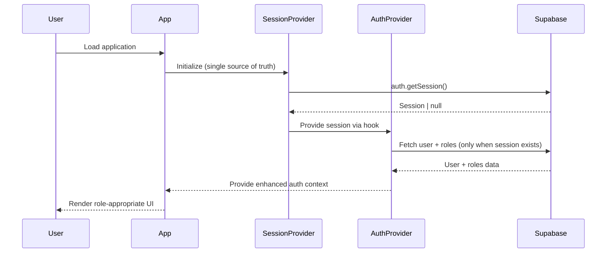
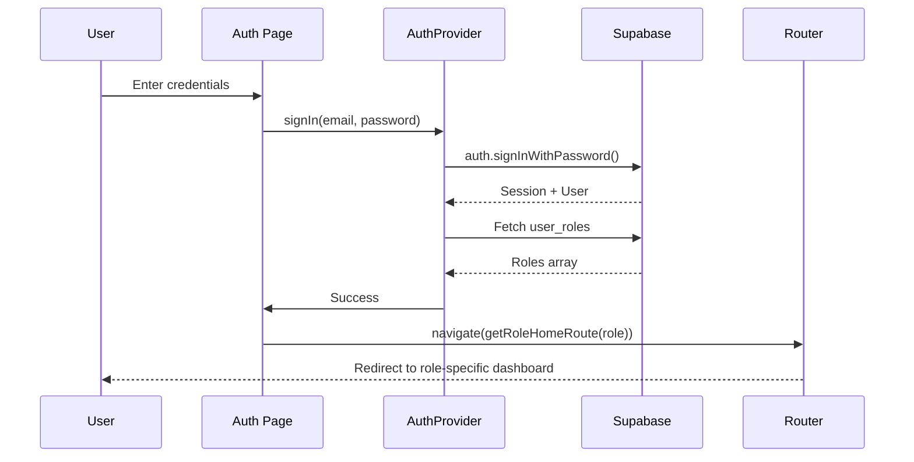

# Monarch Context Architecture

## Provider Hierarchy

```
GlobalErrorBoundary
└── SessionProvider         ← Session state (auth.getSession)
    └── A11yProvider        ← Accessibility features
        └── App
            └── QueryClientProvider
                └── ThemeProvider      ← Dark/light mode
                    └── AuthProvider   ← User + roles + permissions
                        └── BrowserRouter
                            └── OptimizedLayout ← Conditional Sidebar/Navbar
```

## Context APIs

### `useSession()`
- **Source:** `SessionProvider` (`src/providers/SessionProvider.tsx`)
- **Returns:** `{ session, isLoading }`
- **Use case:** Access raw Supabase session for token management
- **Example:**
  ```tsx
  const { session, isLoading } = useSession();
  if (isLoading) return <LoadingSpinner />;
  ```

### `useAuth()`
- **Source:** `AuthProvider` (`src/contexts/OptimizedAuthContext.tsx`)
- **Returns:** `{ user, session, isAuthenticated, hasRole(), hasPermission(), signIn(), signOut(), updateProfile(), ... }`
- **Use case:** Full auth state + role checks + profile management
- **Example:**
  ```tsx
  const { user, hasRole, signOut } = useAuth();
  if (hasRole('admin')) return <AdminPanel />;
  ```

### `useTheme()`
- **Source:** `next-themes` ThemeProvider
- **Returns:** `{ theme, setTheme, systemTheme, resolvedTheme }`
- **Use case:** Dark/light mode control
- **Example:**
  ```tsx
  const { theme, setTheme } = useTheme();
  <button onClick={() => setTheme(theme === 'dark' ? 'light' : 'dark')}>
    Toggle Theme
  </button>
  ```

## Role-Based Routing

### Automatic Layout Selection

Routes automatically render different layouts based on authentication state and path:

| Route Pattern | Layout | Navigation | Auth Required |
|--------------|--------|------------|---------------|
| `/` (public) | Standard | Navbar only | ❌ No |
| `/auth` | Auth page | None | ❌ No |
| `/dashboard/*` | Dashboard | Sidebar + General nav | ✅ Yes |
| `/admin/*` | Dashboard | Sidebar + Admin nav | ✅ Yes (admin) |
| `/vendor/*` | Dashboard | Sidebar + Vendor nav | ✅ Yes (vendor) |

**Layout Logic** (`src/components/OptimizedLayout.tsx`):
```tsx
const showSidebar = isAuthenticated && 
  (pathname.startsWith('/dashboard') || 
   pathname.startsWith('/admin') || 
   pathname.startsWith('/vendor') ||
   pathname.startsWith('/tenant'));
```

### Role-Based Home Routes

After successful authentication, users are redirected to their role-appropriate dashboard:

```tsx
// src/lib/roleRoutes.ts
export const ROLE_HOME_ROUTES: Record<UserRole, string> = {
  admin: '/admin',
  property_manager: '/dashboard/projects',
  vendor: '/vendor/dashboard',
  tenant: '/dashboard',
};
```

**Priority System:**
When a user has multiple roles, the highest-priority role determines the home route:
1. `admin` (highest)
2. `property_manager`
3. `vendor`
4. `tenant` (lowest)

### Protected Routes

All authenticated routes use `<OptimizedProtectedRoute>` which:

1. **Authentication Check:** Verifies `isAuthenticated` via `useAuth()`
2. **Role Validation:** Checks `hasRole(requiredRole)` against user's roles
3. **Redirect Logic:**
   - Not authenticated → `/auth`
   - Missing required role → `/dashboard`
   - Subscription required but inactive → `/dashboard/subscription`

**Example:**
```tsx
<Route
  path="/admin/*"
  element={
    <OptimizedProtectedRoute requiredRole="admin">
      <AdminRoutes />
    </OptimizedProtectedRoute>
  }
/>
```

## Data Flow

### Authentication Flow



**Key Points:**
- SessionProvider is the **single source of truth** for session state
- AuthProvider **consumes** SessionProvider via `useSession()` hook
- No session duplication - reduces redundant queries
- Role fetching only happens when session exists
- Cache prevents repeated role queries (5-minute TTL)

### Login Flow with Role-Based Redirect



## Role & Permission System

### Role Storage

**Authoritative Source:** `user_roles` table (NOT `profiles.role`)

```sql
-- user_roles table structure
CREATE TABLE user_roles (
  id UUID PRIMARY KEY,
  user_id UUID REFERENCES auth.users,
  role TEXT NOT NULL,
  created_at TIMESTAMPTZ DEFAULT now()
);
```

**Why not `profiles.role`?**
- ❌ Single role limitation
- ❌ No audit trail
- ❌ Difficult to manage multi-role users
- ✅ `user_roles` supports multiple roles per user
- ✅ RLS policies prevent unauthorized role assignment
- ✅ Audit trail built-in

### Role Checking

```tsx
// Check single role
if (hasRole('admin')) { /* admin-only UI */ }

// Check multiple roles (OR logic)
if (hasRole(['admin', 'property_manager'])) { /* either role */ }

// Check permission scope
if (hasPermission('projects:write')) { /* can edit projects */ }
```

### Role Cache

**Implementation:** 5-minute in-memory cache in `AuthProvider`

**Purpose:**
- Reduce database queries
- Improve performance
- Balance freshness vs. load

**Cache invalidation:**
```tsx
// Manual refresh
await refreshUser();

// Automatic on auth state change
supabase.auth.onAuthStateChange(() => {
  // Cache cleared and roles refetched
});
```

## Security Architecture

### RLS Policies

All data access is controlled by Row Level Security policies:

```sql
-- Example: Users can only read their own profile
CREATE POLICY "Users can read own profile"
  ON profiles FOR SELECT
  USING (auth.uid() = id);

-- Example: Only admins can read all profiles
CREATE POLICY "Admins can read all profiles"
  ON profiles FOR SELECT
  USING (is_admin_user(auth.uid()));
```

### Security Functions

**SECURITY DEFINER functions** check roles server-side:

```sql
CREATE OR REPLACE FUNCTION is_admin_user(user_id UUID)
RETURNS BOOLEAN
LANGUAGE plpgsql
SECURITY DEFINER
SET search_path = public
AS $$
BEGIN
  RETURN EXISTS (
    SELECT 1 FROM user_roles
    WHERE user_roles.user_id = $1 AND role = 'admin'
  );
END;
$$;
```

**Why SECURITY DEFINER?**
- Runs with elevated privileges
- Prevents client-side bypass
- Enforces business logic server-side
- Required for RLS policies that query restricted tables

### Security Best Practices

✅ **DO:**
- Use `SECURITY DEFINER` for all privilege-checking functions
- Set `search_path = public` explicitly
- Check roles via `user_roles` table
- Use parameterized queries ($1, $2, etc.)
- Enable RLS on all user-facing tables
- Log security events to `audit_logs`

❌ **DON'T:**
- Fetch roles from `profiles.role` directly
- Trust client-side role checks alone
- Expose service role keys client-side
- Use string concatenation in SQL
- Grant PUBLIC access to sensitive tables
- Skip RLS on "internal" tables

## Performance Considerations

### Code Splitting

Routes are lazy-loaded for optimal bundle size:

```tsx
const Dashboard = lazy(() => import("@/pages/Dashboard"));
const AdminRoutes = lazy(() => import("@/pages/admin"));
```

### Performance Monitoring

Built-in monitoring via:
- `PerformanceMonitor.tsx` - Tracks component render times
- `WebVitalsTracker.tsx` - Measures Core Web Vitals
- React DevTools Profiler integration
- Auto-optimization utilities in `lib/performanceOptimizations.ts`

**Target Metrics:**
- LCP (Largest Contentful Paint) < 2.5s
- CLS (Cumulative Layout Shift) < 0.1
- INP (Interaction to Next Paint) < 200ms

**Implemented Optimizations:**
- Critical asset preloading (fonts)
- Lazy image loading with Intersection Observer
- Route prefetching for predicted navigation
- Preconnect to Supabase domain
- Reduced motion detection
- Code splitting with dynamic imports

### Asset Optimization

- **Fonts:** Preloaded in `index.html`
- **Icons:** Tree-shaken from `lucide-react`
- **Images:** Lazy-loaded with `loading="lazy"`
- **CSS:** Tailwind JIT compilation

## Accessibility

### A11y Provider

**Features:**
- Keyboard navigation support
- Screen reader announcements
- Focus management
- Reduced motion detection
- High contrast mode support

**Usage:**
```tsx
const { announceToScreenReader, prefersReducedMotion } = useA11y();

// Announce dynamic changes
announceToScreenReader("Profile updated successfully");

// Respect motion preferences
const transition = prefersReducedMotion ? "none" : "all 0.3s ease";
```

### WCAG Compliance

- **Color Contrast:** All text meets WCAG AA (4.5:1 minimum)
- **Keyboard Navigation:** All interactive elements reachable via Tab
- **ARIA Labels:** Descriptive labels on all form fields
- **Focus Indicators:** Visible focus rings on all focusable elements
- **Skip Links:** "Skip to main content" link for screen readers

## Environment Variables

### Required Variables

```env
# Supabase Configuration
VITE_SUPABASE_URL=https://yhegaaqxmuhszesbjtdo.supabase.co
VITE_SUPABASE_ANON_KEY=eyJhbGc...

# Optional: Analytics
VITE_GA_TRACKING_ID=G-XXXXXXXXXX
```

### Variable Naming

- ✅ `VITE_*` - Exposed to client (safe for public APIs)
- ❌ `SECRET_*` - Never expose these client-side
- ⚠️ Service role keys must ONLY be used server-side (Edge Functions)

## Troubleshooting

### Common Issues

**Problem:** "useAuth must be used within AuthProvider"
- **Cause:** Component rendered outside AuthProvider context
- **Fix:** Ensure component is wrapped in AuthProvider hierarchy

**Problem:** Roles not updating after assignment
- **Cause:** Role cache not invalidated
- **Fix:** Call `refreshUser()` or wait 5 minutes for cache expiry

**Problem:** Protected route redirects to /auth despite being logged in
- **Cause:** Roles not loaded yet
- **Fix:** Check `isLoading` state before rendering protected content

**Problem:** Layout flicker on route change
- **Cause:** Missing Suspense boundary
- **Fix:** All lazy-loaded routes wrapped in `<Suspense fallback={<LoadingSpinner />}>`

## Testing Strategy

### Unit Tests
- Context providers (SessionProvider, AuthProvider)
- Role checking functions (`hasRole`, `hasPermission`)
- Route utilities (`getRoleHomeRoute`)

### Integration Tests
- Login flow → role-based redirect
- Protected route access control
- Layout rendering based on auth state

### E2E Tests
- Complete user signup → login → dashboard navigation
- Role-based feature access
- Session persistence across page refreshes

## Future Enhancements

### Planned Improvements
1. **Real-time role updates** via Supabase Realtime subscriptions
2. **Multi-factor authentication** for admin users
3. **Session timeout warnings** before auto-logout
4. **Role request workflow** for users to request elevated permissions

### Performance Targets
- Initial load: < 1.5s (LCP)
- Route transition: < 100ms
- Auth state resolution: < 300ms
- Role check: < 50ms (cached)

---

**Last Updated:** 2025-10-26  
**Architecture Version:** 2.0  
**Framework:** React 18.3 + Vite + React Router v6
