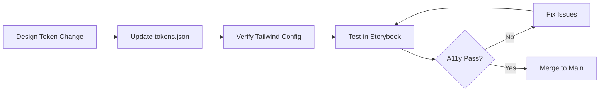

# Monarch Design System — Storybook Documentation

## Accessing Storybook

- **Local Development**: `npm run storybook` → `http://localhost:6006`
- **Production**: https://design.monarchpropertymmgt.com (when deployed)

## Running Storybook

```bash
# Start Storybook development server
npm run storybook

# Build Storybook for production
npm run build-storybook
```

## Using Components

### Import from Design System
```tsx
import { HeroBlock } from "@/design-system/components/Hero/HeroBlock";
import { Card } from "@/design-system/components/Card/Card";
import { CTABanner } from "@/design-system/components/CTA/CTABanner";
```

### Import from Shadcn/UI
```tsx
import { Button } from "@/components/ui/button";
import { Input } from "@/components/ui/input";
import { Label } from "@/components/ui/label";
```

### Accessing Tokens Programmatically
```tsx
import { tokens, hslToColor } from "@/lib/theme";

const MyComponent = () => (
  <div style={{ backgroundColor: hslToColor(tokens.colors.brand.primary) }}>
    Token-driven background
  </div>
);
```

## Token Mapping Reference

| Component | Token Properties |
|-----------|------------------|
| Button | `colors.brand.primary`, `borderRadius.md`, `spacing.md`, `motion.duration.normal` |
| Card | `shadow.sm/lg`, `borderRadius.lg`, `spacing.lg` |
| Hero | `typography.fontSize.5xl`, `typography.fontFamily.heading`, `motion.duration.slow` |
| Input | `colors.ui.border`, `borderRadius.md`, `spacing.md` |
| CTA Banner | `colors.brand.primary`, `typography.fontSize.4xl`, `spacing.2xl` |

## Accessibility Standards

All components meet WCAG 2.2 AA:
- ✅ Color contrast ≥ 4.5:1
- ✅ Keyboard navigable
- ✅ Touch targets ≥ 44×44px
- ✅ Reduced motion support
- ✅ ARIA labels where appropriate

## Visual Regression Testing

Run Chromatic on every PR:
```bash
npx chromatic --exit-zero-on-changes
```

## Theme Switching

All stories support light/dark mode switching via the Storybook toolbar. Use the theme toggle to test components in both modes.

## Story Structure

Each component story includes:
1. **Default** — Basic usage example
2. **Variants** — All available style variants
3. **Interactive** — Interactive examples with controls
4. **Token Mapping** — Documentation of which tokens are used

## Adding New Stories

When creating a new component, add a corresponding `.stories.tsx` file:

```tsx
import type { Meta, StoryObj } from "@storybook/react";
import { YourComponent } from "@/components/YourComponent";

const meta: Meta<typeof YourComponent> = {
  title: "Components/YourComponent",
  component: YourComponent,
  tags: ["autodocs"],
};

export default meta;
type Story = StoryObj<typeof YourComponent>;

export const Default: Story = {
  args: {
    // your props
  },
};
```

## Best Practices

1. **Token-First Development** — Always use design tokens instead of hardcoded values
2. **Accessibility Testing** — Check the A11y panel for every story
3. **Responsive Testing** — Test all viewport sizes (mobile, tablet, desktop)
4. **Theme Parity** — Ensure components work in both light and dark themes
5. **Documentation** — Include token mapping tables for reference

## Component Lifecycle



## Troubleshooting

### Storybook won't start
```bash
# Clear cache and restart
rm -rf node_modules/.cache
npm run storybook
```

### Components not rendering
- Check that all imports use `@/` alias
- Verify `index.css` is imported in `.storybook/preview.tsx`
- Ensure component exports are correct

### Theme not switching
- Verify `withThemeByClassName` is in preview decorators
- Check that components use semantic color tokens (not hardcoded colors)

## Resources

- [Storybook Documentation](https://storybook.js.org/docs/react/get-started/introduction)
- [Design Tokens](./tokens.md)
- [Quick Start Guide](./QUICK_START_GUIDE.md)
